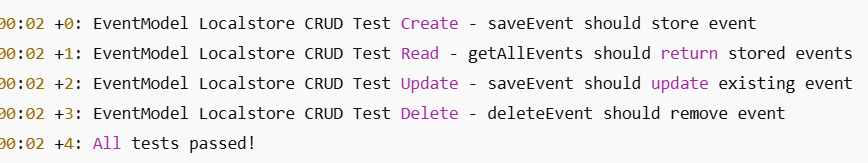

# Bài tập lớn - Phát triển ứng dụng với Flutter

## Thông tin sinh viên
- **Họ và tên**: Trương Công Chương
- **MSSV**: 2221050390
- **Lớp**: DCCTCLC67B


## Báo cáo kết quả
1. Tải mã nguồn từ repository.
    ```bash
    git clone https://github.com/truongcongchuong/BTL.git
    ```

2. Cài đặt các dependencies:
   ```bash
   flutter pub get
   ```
3. Chạy ứng dụng:
   ```bash
   flutter run
   ```
4. Kiểm tra ứng dụng trên thiết bị hoặc máy ảo.
5. Thực hiện các thao tác CRUD và kiểm tra kết quả.
- link video demo: https://drive.google.com/drive/folders/1mjUlvgKlfnfmjoFtBfKiSPPJ5Cqi0bTn
6. Thực hiện kiểm thử tự động và xem kết quả:
    ```bash
    flutter test
    ```
  - kết quả 
   
7. các thư viện sử dụng
- intl: ^0.20.2: thư viện để làm đa ngôn ngữ
- localstore: ^1.4.0: Thư viện lưu trữ dữ liệu cục bộ (local storage) dạng NoSQL
- syncfusion_flutter_calendar: ^28.1.38: Thư viện Calendar chuyên nghiệp của Syncfusio

## Tiêu chí đánh giá
**5/10 điểm - Build thành công (GitHub Actions báo “Success”)**
- Sinh viên đạt tối thiểu 5 điểm nếu GitHub Actions hoàn thành build và kiểm thử mà không có lỗi nào xảy ra (kết quả báo “Success”).
- Điểm này dành cho những sinh viên đã hoàn thành cấu hình cơ bản và mã nguồn có thể chạy nhưng có thể còn thiếu các tính năng hoặc có các chức năng chưa hoàn thiện.
- Nếu gặp lỗi liên quan đến `Billing & plans` thì phải đảm bảo chay thành công trên máy cá nhân và cung cấp video demo cùng với lệnh `flutter test` chạy thành công.

**6/10 điểm - Thành công với kiểm thử cơ bản (CRUD tối thiểu)**
- Sinh viên đạt 6 điểm nếu build thành công và vượt qua kiểm thử cho các chức năng CRUD cơ bản (tạo, đọc, cập nhật, xóa) cho đối tượng chính.
- Tối thiểu cần thực hiện CRUD với một đối tượng cụ thể (ví dụ: sản phẩm hoặc người dùng), đảm bảo thao tác cơ bản trên dữ liệu.

**7/10 điểm - Kiểm thử CRUD và trạng thái (UI cơ bản, quản lý trạng thái)**
- Sinh viên đạt 7 điểm nếu ứng dụng vượt qua các kiểm thử CRUD và các kiểm thử về quản lý trạng thái.
- Giao diện hiển thị danh sách và chi tiết đối tượng cơ bản, có thể thực hiện các thao tác CRUD mà không cần tải lại ứng dụng.
- Phản hồi người dùng thân thiện (hiển thị kết quả thao tác như thông báo thành công/thất bại).

**8/10 điểm - Kiểm thử CRUD, trạng thái và tích hợp API hoặc/và CSDL**
- Sinh viên đạt 8 điểm nếu ứng dụng vượt qua kiểm thử cho CRUD, trạng thái, và tích hợp API hoặc/và cơ sở dữ liệu (Firebase, MySQL hoặc lưu trữ cục bộ) hoặc tương đương.
- API hoặc cơ sở dữ liệu phải được tích hợp hoàn chỉnh, các thao tác CRUD liên kết trực tiếp với backend hoặc dịch vụ backend.
- Các lỗi từ API hoặc cơ sở dữ liệu được xử lý tốt và có thông báo lỗi cụ thể cho người dùng.

**9/10 điểm - Kiểm thử tự động toàn diện và giao diện hoàn thiện**
- Sinh viên đạt 9 điểm nếu vượt qua các kiểm thử toàn diện bao gồm:
- CRUD đầy đủ
- Quản lý trạng thái
- Tích hợp API/CSDL
- Giao diện người dùng hoàn chỉnh và thân thiện, dễ thao tác, không có lỗi giao diện chính.
- Đảm bảo chức năng xác thực (nếu có), cập nhật thông tin cá nhân, thay đổi mật khẩu (nếu có).

**10/10 điểm - Kiểm thử và tối ưu hóa hoàn chỉnh, UI/UX mượt mà, CI/CD ổn định**
- Sinh viên đạt 10 điểm nếu ứng dụng hoàn thành tất cả kiểm thử tự động một cách hoàn hảo và tối ưu hóa tốt (không có cảnh báo trong kiểm thử và phân tích mã nguồn).
- UI/UX đẹp và mượt mà, có tính nhiều tính năng và tính năng nâng cao (ví dụ: tìm kiếm, sắp xếp, lọc dữ liệu).
- GitHub Actions CI/CD hoàn thiện, bao gồm kiểm thử và các bước phân tích mã nguồn (nếu thêm), đảm bảo mã luôn ổn định.

**Tóm tắt các mức điểm:**
- **5/10**: Build thành công, kiểm thử cơ bản chạy được.
- **6/10**: CRUD cơ bản với một đối tượng.
- **7/10**: CRUD và quản lý trạng thái (hiển thị giao diện cơ bản).
- **8/10**: CRUD, trạng thái, và tích hợp API/CSDL với thông báo lỗi.
- **9/10**: Hoàn thiện kiểm thử CRUD, trạng thái, tích hợp API/CSDL; UI thân thiện.
- **10/10**: Tối ưu hóa hoàn chỉnh, UI/UX mượt mà, CI/CD đầy đủ và ổn định.

## Tự đánh giá điểm: 6/10
